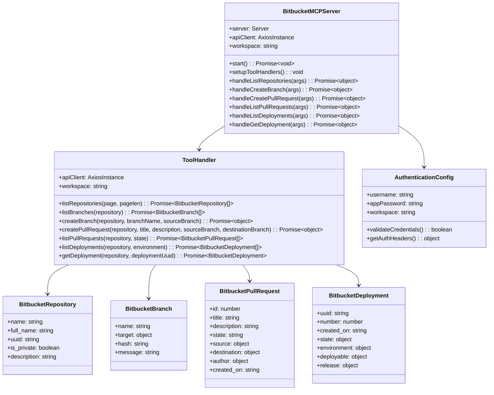

# Code-Level Details - Bitbucket MCP Server

## Code-Level Details

### Class Diagram
**Core Classes:** The main classes that implement the MCP server functionality for Bitbucket integration, including server management, API client operations, and data models.

### Sequence Diagram
**Pull Request Creation Flow:** Shows the sequence of interactions when an AI assistant creates a pull request through the MCP server, including authentication, validation, and API communication.



```mermaid
sequenceDiagram
    participant AI as AI Assistant
    participant MCP as MCP Server
    participant TH as Tool Handler
    participant API as Bitbucket API
    participant Auth as Auth Config

    AI->>MCP: createPullRequest({repository, title, description, source_branch, destination_branch})
    MCP->>MCP: Validate request schema
    MCP->>TH: handleCreatePullRequest(args)
    TH->>Auth: getAuthHeaders()
    Auth-->>TH: {Authorization: "Basic ..."}
    TH->>API: POST /repositories/{workspace}/{repo}/pullrequests
    API-->>TH: Pull request created response
    TH->>TH: Format response for MCP
    TH-->>MCP: Formatted pull request data
    MCP-->>AI: MCP tool response with pull request details

    Note over AI,API: Deployment tracking flow
    AI->>MCP: listDeployments({repository, environment})
    MCP->>TH: handleListDeployments(args)
    TH->>API: GET /repositories/{workspace}/{repo}/environments
    TH->>API: GET /repositories/{workspace}/{repo}/deployments
    API-->>TH: Deployment data with environment mapping
    TH->>TH: Filter by environment and format response
    TH-->>MCP: Formatted deployment list
    MCP-->>AI: MCP tool response with deployment details

    Note over AI,API: Error handling flow
    API-->>TH: Error response (e.g., 400, 401, 404)
    TH->>TH: Handle API error
    TH-->>MCP: Formatted error response
    MCP-->>AI: MCP error response
