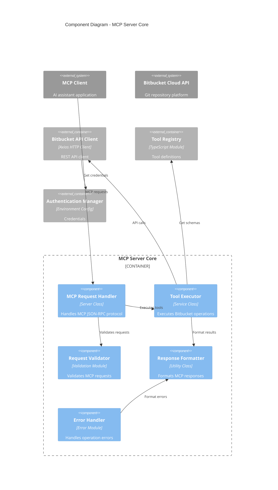

# Component View - Bitbucket MCP Server

## Component View

### Component Diagram: MCP Server Core
**Container Overview:** The main MCP protocol server built with Node.js/TypeScript that handles incoming MCP requests, routes tool calls, and manages the communication with Bitbucket Cloud API.  

**Key Components in MCP Server Core:**  
- `MCP Request Handler` – `Server Class: Handles incoming MCP JSON-RPC requests and manages the MCP protocol lifecycle`  
- `Tool Executor` – `Service Class: Executes specific Bitbucket operations like repository management, branch creation, and pull request operations`  
- `Request Validator` – `Validation Module: Validates incoming MCP requests against tool schemas and parameter requirements`  
- `Response Formatter` – `Utility Class: Formats API responses into MCP protocol-compliant responses`  
- `Error Handler` – `Error Module: Handles and formats errors from Bitbucket API and internal operations`

**Internal Interactions:** _(how components interact within MCP Server Core)_  
- `MCP Request Handler` → `Request Validator` – `Validates incoming requests before processing`  
- `MCP Request Handler` → `Tool Executor` – `Delegates tool execution requests based on tool name`  
- `Tool Executor` → `Bitbucket API Client` – `Makes authenticated API calls to perform operations`  
- `Tool Executor` → `Response Formatter` – `Formats successful operation results`  
- `Error Handler` → `Response Formatter` – `Formats error responses for MCP protocol`

