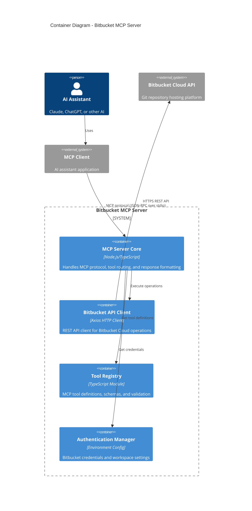

# Container View - Bitbucket MCP Server

## Container View
**Containers of Bitbucket MCP Server:** _(key services, modules, etc.)_  
- `MCP Server Core` – `Node.js/TypeScript: Main MCP protocol server handling tool definitions, request routing, and response formatting`  
- `Bitbucket API Client` – `Axios HTTP Client: REST API client for Bitbucket Cloud operations including authentication and request handling`  
- `Tool Registry` – `TypeScript Module: Manages MCP tool definitions, schemas, and validation for Bitbucket operations`  
- `Authentication Manager` – `Environment Config: Handles Bitbucket credentials and workspace configuration from environment variables`  

**Container Interactions:** _(how containers communicate)_ 
- `MCP Server Core` → `Bitbucket API Client` – `Function calls to execute Bitbucket repository and pull request operations`  
- `MCP Server Core` → `Tool Registry` – `Retrieves tool definitions, validates requests, and formats responses`  
- `MCP Server Core` → `Authentication Manager` – `Gets Bitbucket credentials and workspace configuration`  
- `Bitbucket API Client` → `Bitbucket Cloud API` – `HTTPS REST API calls for repository, branch, and pull request management`  
- `MCP Client` → `MCP Server Core` – `JSON-RPC over stdio for MCP protocol communication`

